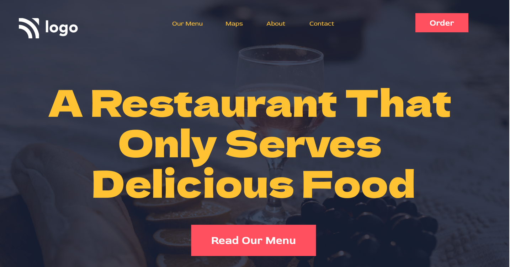

# 2. A webpage with a Restaurant theme

## Learnings from this:

- Positioning in CSS
- When to make use of margins and paddings
- How to position background image
- This site is desktop responsive only

## Time Taken:

- Around 2 hours

## Preview Of Site

## Live Link

[Netlify](https://restor.netlify.app)
